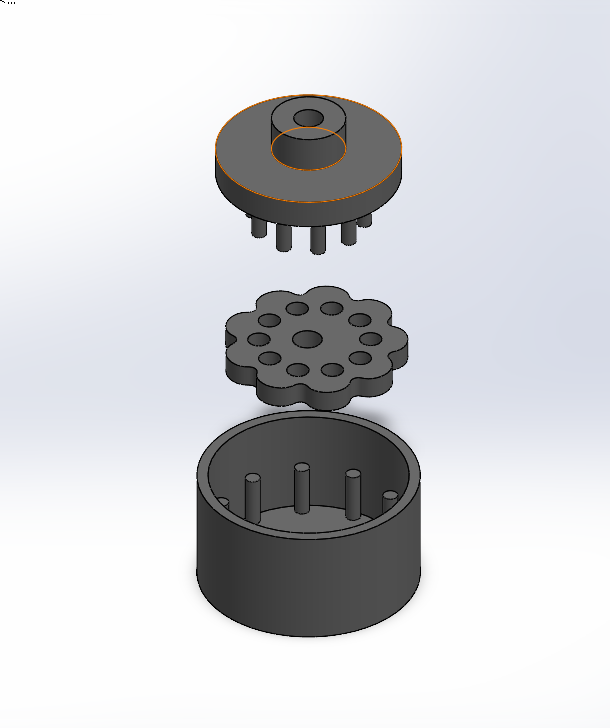

\# Printable Servo Gearbox - Cycloidal 1:10


A zero-backlash cycloidal gearbox designed for drone applications, fully 3D printable, compatible with MG996R servos.


\*\*Reduction ratio : 1:10\*\*



\## Features


\- 1. 100% 3D printable - no hardware except the servo

\- 2. Zero backlash - cycloidal geometry eliminates play

\- 3. Modular ratio - swap the cycloidal disc to change ratio

\- 4. Lightweight - optimized for drone use

\- 5. MG996R compatible


\## Geometry


| Parameter | Value |

|---|---|

| Reduction ratio | 1:10 |

| Cycloidal disc teeth | 10 |

| Ring pins | 11 |

| Eccentricity | 2 mm |

| Roller pin diameter | 4 mm |

| Output pins | 10 |

| Housing diameter | 60 mm |


\## Files


```

cad/          # SolidWorks source files (.SLDPRT, .SLDASM)

stl/          # Print-ready STL files

docs/         # Design notes and equations

images/       # Renders and photos

```


\## Print settings


| Part | Material | Infill | Layer height |
|---|---|---|---|
| Housing | PETG | 40% | 0.2mm |
| Cycloidal disc | PETG | 60% | 0.15mm |
| Output flange | PETG | 50% | 0.2mm |


\## Design equations


The cycloidal disc profile is defined by :

```
x(θ) = R·cos(θ) - r·cos(θ + φ) - e·cos(N·θ)
y(θ) = -R·sin(θ) + r·sin(θ + φ) + e·sin(N·θ)

φ = atan(sin((1-N)θ) / (R/(e·N) - cos((1-N)θ)))
```


Where :
- `R` = ring pin circle radius (25 mm)
- `r` = ring pin radius (2 mm)
- `e` = eccentricity (2 mm)
- `N` = number of cycloidal disc lobes (10)


\## Status


## Status

- [x] Concept and geometry defined
- [x] SolidWorks CAD model (housing, cycloidal disc, output flange, assembly)
- [ ] FEA stress analysis
- [ ] First print prototype
- [ ] Test results


\## Author


\*\*Attisso R-H\*\* - Mechatronics engineer

